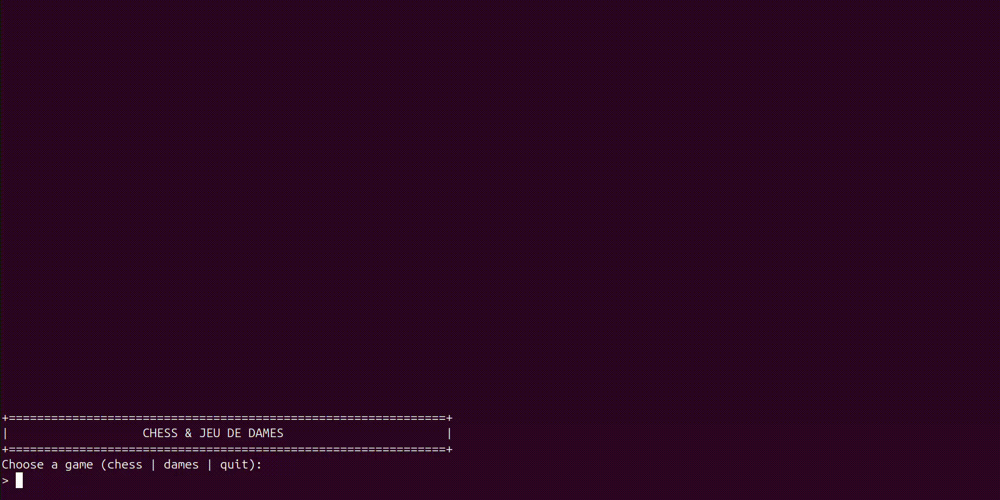

# Chess and Checkers

C++ project with two board games:

- Chess
- Jeu de Dames (french version of Checkers)

## Rules

### Chess Rules

Check the official rules of chess on [FIDE's website](https://www.fide.com). You can check this pdf for a quick overview: [Chess Rules PDF](FIDE_LawsOfChess.pdf).
Or you can also refer to [Chess.com](https://www.chess.com/learn-how-to-play-chess) for a beginner-friendly guide.

### Jeu de Dames Rules

Check the official rules of Jeu de Dames on [Fédération Française du Jeu de Dames](https://www.ffjd.fr/Web/index.php?page=reglesdujeu).

## Demo

### Chess Demo

[](assets/liveDemo_chess.webm)

Direct video link: [assets/liveDemo_chess.webm](assets/liveDemo_chess.webm)

You can also use local demo files from [demo_chess](demo_chess).

### Jeu de Dames Demo

[](assets/liveDemo_jeuDeDames.webm)

Direct video link: [assets/liveDemo_jeuDeDames.webm](assets/liveDemo_jeuDeDames.webm)

You can also use local demo files from [demo_jeuDD](demo_jeuDD).

## Build and Run

```bash
make
./main
```

## Run Tests

```bash
make test
```

## License

MIT License. See [LICENSE](LICENSE).
